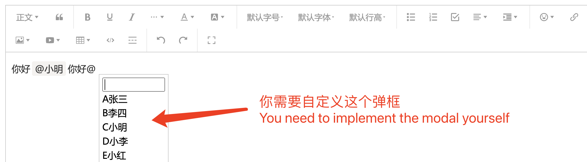

# wangEditor hashtag 插件

[English Documentation](./README-en.md)

## 介绍

**Fork from https://github.com/wangeditor-team/wangEditor-plugin-mention**

[wangEditor](https://www.wangeditor.com/) hashtag 插件，如 `#张三`。



## 安装

```shell
yarn add wangeditor-hashtag-plugin
```

## 使用

[Vue 示例源码](https://github.com/wangfupeng1988/vue2-wangeditor-demo/blob/master/src/components/MyEditorWithMention.vue)

### 注册到编辑器

```ts
import { IDomEditor, Boot, IEditorConfig } from '@wangeditor/editor'
import hashtagModule, { HashtagElement } from 'wangeditor-hashtag-plugin'

// 注册。要在创建编辑器之前注册，且只能注册一次，不可重复注册。
Boot.registerModule(hashtagModule)

// 显示弹框
function showModal(editor: IDomEditor) {
  // 获取光标位置，定位 modal
  const domSelection = document.getSelection()
  const domRange = domSelection.getRangeAt(0)
  if (domRange == null) return
  const selectionRect = domRange.getBoundingClientRect()

  // 获取编辑区域 DOM 节点的位置，以辅助定位
  const containerRect = editor.getEditableContainer().getBoundingClientRect()

  // 显示 modal 弹框，并定位
  // PS：modal 需要自定义，如 <div> 或 Vue React 组件


  // 当触发某事件（如点击一个按钮）时，插入 hashtag 节点
  function insertHashtag() {
    const hashtagNode: HashtagElement = {
      type: 'hashtag', // 必须是 'hashtag'
      value: '张三', // 文本
      info: { x: 1, y: 2 }, // 其他信息，自定义
      children: [{ text: '' }], // 必须有一个空 text 作为 children
    }

    editor.restoreSelection() // 恢复选区
    editor.deleteBackward('character') // 删除 '#'
    editor.insertNode(hashtagNode) // 插入 hashtag
    editor.move(1) // 移动光标
  }
}

// 隐藏弹框
function hideModal(editor: IDomEditor) {
  // 隐藏 modal
}

// 编辑器配置
const editorConfig: Partial<IEditorConfig> = {
  EXTEND_CONF: {
    hashtagConfig: {
      showModal, // 必须
      hideModal, // 必须
    },
  },

  // 其他...
}

// 创建创建和工具栏，会用到 editorConfig 。具体查看 wangEditor 文档
```

### 显示 HTML

hashtag 节点返回的 HTML 格式如下，其中 `data-info` 的值需要 `decodeURIComponent` 解析。

```html
<span data-w-e-type="hashtag" data-w-e-is-void data-w-e-is-inline data-value="张三" data-info="%7B%22x%22%3A10%7D">#张三</span>
```

### 自定义样式 css 变量

```css
--w-e-hashtag-ml: 2px;
--w-e-hashtag-mr: 2px;
--w-e-hashtag-radius: 4px;
--w-e-hashtag-pd: 2px;
--w-e-hashtag-text-color: #1472ff;
--w-e-hashtag-bg-color: transparent;
--w-e-hashtag-selected-border-color: #b4d5ff;
```